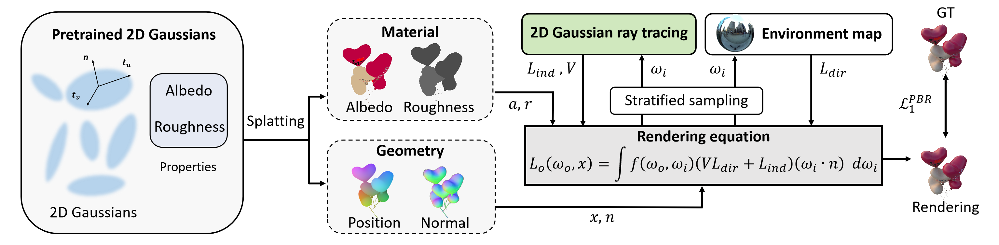

# IRGS: Inter-Reflective Gaussian Splatting with 2D Gaussian Ray Tracing
### [[Project]](https://fudan-zvg.github.io/IRGS) [[Paper]](https://arxiv.org/abs/2412.15867) 

> [**IRGS: Inter-Reflective Gaussian Splatting with 2D Gaussian Ray Tracing**](https://arxiv.org/abs/2412.15867),            
> [Chun Gu](https://sulvxiangxin.github.io/), Xiaofei Wei, Zixuan Zeng, Yuxuan Yao, [Li Zhang](https://lzrobots.github.io)  
> **Arxiv preprint**

**Official implementation of "IRGS: Inter-Reflective Gaussian Splatting with 2D Gaussian Ray Tracing".** 

https://github.com/user-attachments/assets/12ec8516-be4b-4b42-a4cd-e09e2bcb964d


## 🛠️ Pipeline
<div align="center">
  
</div><br/>

## ⚙️ Installation
```bash
git clone https://github.com/fudan-zvg/IRGS.git

# This step is same as 2DGS/3DGS
# Please be aware that the submodules/diff-surfel-rasterization is slightly different from the original version in 2DGS.
conda env create --file environment.yml
conda activate irgs

# Install diff-surfel-rasterization and simple-knn
pip install submodules/diff-surfel-rasterization submodules/simple-knn

# Install raytracing (for Ref-Gaussian in stage 1)
pip install submodules/raytracing

# Install 2D Gaussian Ray Tracer
cd submodules/surfel_tracer && rm -rf ./build && mkdir build && cd build && cmake .. && make && cd ../ && cd ../../
pip install submodules/surfel_tracer
```

## 📦 Dataset
Download the Syn4Relight dataset from [LINK](https://drive.google.com/file/d/1wWWu7EaOxtVq8QNalgs6kDqsiAm7xsRh/view?usp=sharing) provided by [InvRender](https://github.com/zju3dv/InvRender).

Download the TensoIR dataset from [LINK](https://zenodo.org/record/7880113#.ZE68FHZBz18) and Environment maps from [LINK](https://drive.google.com/file/d/10WLc4zk2idf4xGb6nPL43OXTTHvAXSR3/view?usp=share_link) provided by [TensoIR](https://github.com/Haian-Jin/TensoIR).

Put them under the `data` folder:
```bash
data
└── Synthetic4Relight
    └── air_baloons
    └── chair
    └── hotdog
    └── jugs
└── TensoIR_Synthetic
    └── armadillo
    └── Environment_Maps
    └── ficus
    └── hotdog
    └── lego
```
## Training
See `run_syn4relight.sh` and `run_tensoir.sh` for training and evaluation scripts on Synthetic4Relight and TensoIR datasets, respectively.
### Stage 1: geometry reconstruction
We recommand to use our group's [Ref-Gaussian](https://github.com/fudan-zvg/ref-gaussian) for robust geometry reconstruction. 
```bash
CUDA_VISIBLE_DEVICES=0 python train_refgaussian.py -s data/Synthetic4Relight/jugs -m outputs/Synthetic4Relight/jugs/refgs --eval -w --lambda_mask_entropy 0.05
```
### Stage 2: material decomposition
```bash
CUDA_VISIBLE_DEVICES=0 python train.py -s data/Synthetic4Relight/jugs  --iterations 20000 --start_checkpoint_refgs outputs/Synthetic4Relight/jugs/refgs/chkpnt50000.pth --envmap_resolution 128 --lambda_base_color_smooth 2 --lambda_roughness_smooth 2 --diffuse_sample_num 256 --envmap_cubemap_lr 0.01 --lambda_light_smooth 0.0005 --init_roughness_value 0.6 --lambda_light 0.1 -m outputs/Synthetic4Relight/jugs/irgs --train_ray
```
## Evaluation
### Evaluation on Synthetic4Relight dataset
```bash
# Evaluate NVS, render various kinds of images
CUDA_VISIBLE_DEVICES=0 python render.py -m outputs/Synthetic4Relight/jugs/irgs --eval --diffuse_sample_num 512

# Compute albedo scale for alignment
CUDA_VISIBLE_DEVICES=0 python compute_albedo_scale_syn4.py -m outputs/Synthetic4Relight/jugs/irgs

# Evaluate the decomposed material (albedo, roughness)
CUDA_VISIBLE_DEVICES=0 python eval_material_syn4.py -m  outputs/Synthetic4Relight/jugs/irgs --albedo_rescale 2

# Evaluate the relighting performance
CUDA_VISIBLE_DEVICES=0 python eval_relighting_syn4.py -m outputs/Synthetic4Relight/jugs/irgs --diffuse_sample_num 512 --light_sample_num 256 --albedo_rescale 2 -e light
```
### Evaluation on TensoIR dataset
```bash
# Evaluate NVS, render various kinds of images
CUDA_VISIBLE_DEVICES=0 python render.py -m outputs/TensoIR_Synthetic/armadillo/irgs --eval --diffuse_sample_num 512

# Compute albedo scale for alignment
CUDA_VISIBLE_DEVICES=0 python compute_albedo_scale_tensoir.py -m outputs/TensoIR_Synthetic/armadillo/irgs

# Evaluate the decomposed material (albedo, normal)
CUDA_VISIBLE_DEVICES=0 python eval_material_tensoir.py -m outputs/TensoIR_Synthetic/armadillo/irgs --albedo_rescale 2

# Evaluate the relighting performance
CUDA_VISIBLE_DEVICES=0 python eval_relighting_tensoir.py -m outputs/TensoIR_Synthetic/armadillo/irgs --diffuse_sample_num 512 --light_sample_num 256 --albedo_rescale 2 -e light   
```

## 📜 BibTeX
```bibtex
@article{gu2024IRGS,
  title={IRGS: Inter-Reflective Gaussian Splatting with 2D Gaussian Ray Tracing},
  author={Gu, Chun and Wei, Xiaofei and Zeng, Zixuan and Yao, Yuxuan and Zhang, Li},
  booktitle={CVPR},
  year={2025},
}
```
